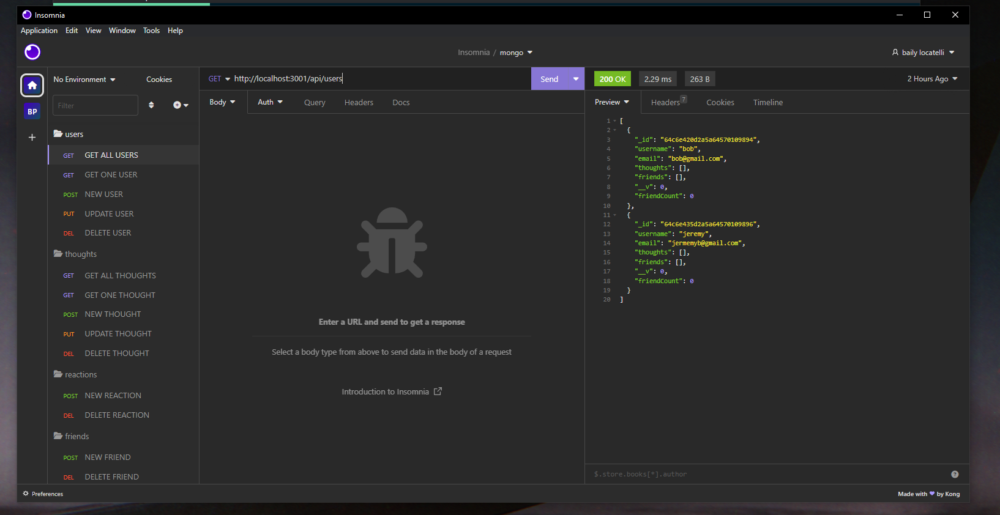
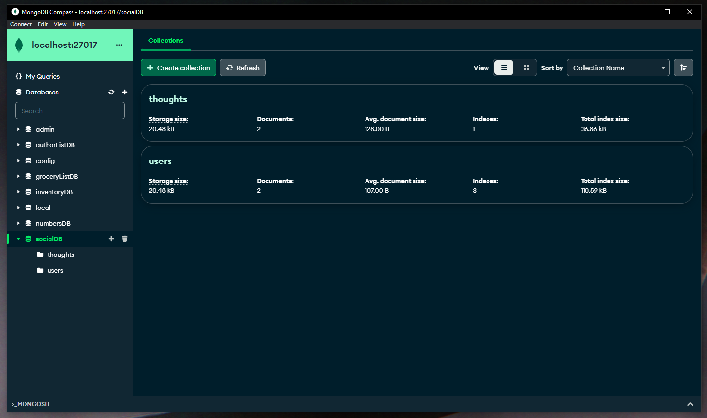

# Social-Networking

  
  
  ## Table of Contents
  * [Description](#description)
  * [Installations](#installation)
  * [Usage](#usage)
  * [License](#license)
  * [Questions](#questions)

  ## Description
  This is a social networking platform where you can keep up with friends by seeing the friends you have added. You can share and see others thoughts and reactions and have your own custom friends list.

  ## Installation
  Use node index.js to start the application. 

  ## Usage
  You can use the mongodb to see the social database and all the information held within. You can use insomnia to GET, POST, PUT, AND DELETE.
  
  

  ## Licenses
    Your application is covered under MIT

  ## Questions
  * Github: https://github.com/b-locatelli
  * Email: bailylocatelli@gmail.com
  * video: https://drive.google.com/file/d/1sgyLCQfFTtCFm3seywWnuva4OEkkeXJP/view
  * repo: https://github.com/b-locatelli/Social-Network-Api
